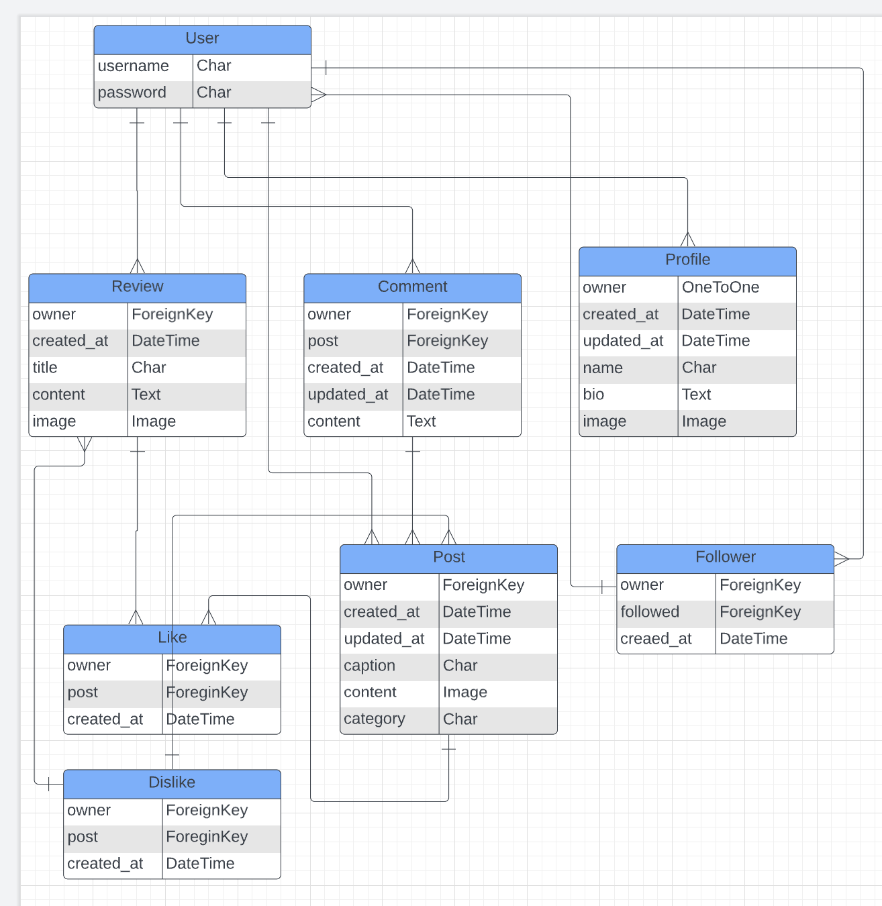

# Crep Chat Backend

Developer: Tom Ainsworth

## Project Description

This repository contains the API for the full stack application Crep Chat - a content site for trainer enthusiasts to chat about their favourite pairs.
It's built using Django and Django Rest Framework.

Link to the frontend repository [Crep Chat frontend](https://github.com/Tom-Ainsworth/crepchat-frontend)

## Contents

- [Crep Chat Backend](#crep-chat-backend)
  - [Project Description](#project-description)
  - [Contents](#contents)
  - [User Stories](#user-stories)
    - [Profile](#profile)
    - [Posts](#posts)
    - [Comments](#comments)
    - [Likes](#likes)
    - [Followers](#followers)
    - [Reviews](#reviews)
  - [Entity Relationship Diagram](#entity-relationship-diagram)
  - [Models and CRUD breakdown](#models-and-crud-breakdown)
  - [Development Process](#development-process)
    - [Current Features](#current-features)
  - [Tests](#tests)
    - [Post Tests](#post-tests)
    - [Manual Tests](#manual-tests)
  - [Deployment Steps](#deployment-steps)

## User Stories

### Profile

- As a user, I can create a profile, so that I can have a username and profile picture when logged in.
- As a user, I can edit my profile, so that I can change my picture and other details when I want to.
- As a user, I can view mine and other's profiles so I can see what people are up to, and vice versa.

### Posts

- As a user, I can create a post, to share my pictures with other users.
- As a user, I can edit a post, so that I can change the details of a post I created.
- As a user, I can delete a post, if I decide I don't want to share it any longer.
- As a user, I can view all of my posts, so that I can see everything I've created in one place.
- As a user, I can see the most liked posts, so that I can discover other users and what's popular.
- As a visitor, I can see the most recent posts, so I can find out whether I like the site or not.

### Comments

- As a user, I can leave a comment on posts, so that I can talk to other users and share what I think of their posts.
- As a user, I can edit my comment, so that if I make a mistake, I can fix it.
- As a user, I can delete my comment, in case I decide that I don't want to comment any more.

### Likes

- As a user, I can like posts, so that I can quickly leave positive feedback on other's posts.
- As a user, I can unlike a post, in case I change my mind or click it by accident.
- As a user I can view the total likes on each of my posts when I click on them, to see how popular they are.

### Followers

- As a user, I can follow other users, so that I can see more of their content.
- As a user, I can unfollow other users, so that I don't have to see their posts any more.
- As a user, I can see a feed of only the users that I follow, so that I can filter the content that I enjoy the most.
- As a user, I can see how many followers I have, and how many people I follow, so that I can see how my profile is growing and how many people I'm connected to.

### Reviews

- As an author, I can write a review, so that I can share my opinions on various products.
- As an author, I can edit a review, to add new details or change any mistakes.
- As an author, I can delete a review, so that the content no longer shows on the site.
- As a user, I can see reviews, so that I can stay up to date on the latest details of the products that I like.
- As a user, I can comment on a review, so that I can share my thoughts with the author.
- As a user, I can like the review, so that the author knows I agree with them.

## Entity Relationship Diagram



## Models and CRUD breakdown

| model     | endpoints                 | create        | retrieve | update | delete | filter             | text search    |
| --------- | ------------------------- | ------------- | -------- | ------ | ------ | ------------------ | -------------- |
| users     | users/ users/:id/         | yes           | yes      | yes    | no     | no                 | no             |
| profiles  | profiles/ profiles/:id/   | yes (signals) | yes      | yes    | no     | following/followed | name           |
| likes     | likes/ likes/:id/         | yes           | yes      | no     | yes    | no                 | no             |
| dislikes  | dislikes/ dislikes/:id/   | yes           | yes      | no     | yes    | no                 | no             |
| comments  | comments/ comments/:id/   | yes           | yes      | yes    | yes    | post               | no             |
| followers | followers/ followers/:id/ | yes           | yes      | no     | yes    | no                 | no             |
| posts     | posts/ posts/:id/         | yes           | yes      | yes    | yes    | profile/liked/feed | title          |
| reviews   | reviews/ reviews/:id/     | yes           | yes      | yes    | yes    | review/liked/feed  | title/category |

## Development Process

### Current Features

In order to ensure that a full minimum viable product is delivered within the deadline given. I decided to hold off on building the reviews portion of the project until the front end is completed without it. If I am able to implement this feature later, I will. I am satisfied that this is not a Must Have feature, as even if done correctly, it could cause confusion when trying to distinguish between a user 'post' and an author 'review'. All other user stories have been met successfully.

## Tests

### Post Tests

Tests were carried out on both the PostList and PostDetail views, and can be [Found Here](posts/tests.py)

### Manual Tests

Please see the [frontend repo](https://github.com/Tom-Ainsworth/crepchat-frontend#testing) for all manual tests covered, as they include the backend functionality

## Deployment Steps

This application has been deployed from GitHub to Heroku by following the steps:

1. Create or log in to your account on [Heroku.com](https://www.heroku.com/))
2. Create a new app, add a unique app name (this project is named "crepchat-api") and choose your region
3. Click on create app
4. Under resources tab search for Postgres in Add-ons section, and add Heroku Postgres to the app. Choose the 'hobby' plan for a free plan. PostgreSQL 'DATABASE_URL' will be added to the app Config Vars.
5. Install the libraries dj-database-url and psycopg2 (pip3 install dj_database_url psycopg2) for mac.
6. In settings.py file import dj_database_url
7. In settings.py add the following if statement to the 'DATABASES' variable. This is to keep the development and production environments and their databases separate.

   ```python
   DATABASES = {
       'default': ({
           'ENGINE': 'django.db.backends.sqlite3',
           'NAME': BASE_DIR / 'db.sqlite3',
       } if 'DEV' in os.environ else dj_database_url.parse(
           os.environ.get('DATABASE_URL')
       ))
   }
   ```

8. Install `pip3 install django-cors-headers` and configure it in settings.py to your specifications. Ensure you add `'corsheaders.middleware.CorsMiddleware'` as high as possible in the MIDDLEWARE settings

9. Pip install gunicorn, then create a `Procfile` in your app:

   ```python
   release: python manage.py makemigrations && python manage.py migrate
   web: gunicorn PROJECT_NAME.wsgi
   ```

   The first line is to ensure that migrations are created and applied to the Heroku postgres database.
   The second line tells Heroku to serve our app using gunicorn.

10. Set the ALLOWED_HOSTS in settings.py

    ```python
    ALLOWED_HOSTS = [
      os.environ.get('ALLOWED_HOST'),
      'localhost',
    ]
    ```

11. In settings.py, update the CORS_ALLOWED_ORIGINS to match your desired project.

12. Add JWT_AUTH_SAMESITE = 'None' to be able to have the front end app and the API deployed to different platforms.

13. Add remaining environment variables settings to env.py file at the root directory. Make sure to add this file to .gitignore.

    ```python
    import os
      os.environ["CLOUDINARY_URL"] = "your_cloudinary_url"
      os.environ['DEV'] = '1'
      os.environ["SECRET_KEY"] = "your_secret_key"
    ```

14. Replace the insecure SECRET_KEY with the environment variable in settings.py

    ```python
    SECRET_KEY = os.enrivon.get('SECRET_KEY')
    ```

15. Change the DEBUG settings DEBUG = 'DEV' in os.environ (it will equal False in production)

16. Go to Settings in your Heroku and set the environment variables in the Config Vars. PostgreSQL DATABASE_URL should already be there.

    ```python
    ALLOWED_HOST | your_deployed_api_url
    CLIENT_ORIGIN | your_deployed_frontend_url
    CLOUDINARY_URL | your_API_variable
    DATABASE_URL | created when added Postgres to Heroku Add-ons
    SECRET_KEY | your_secret_key
    DISABLE_COLLECTSTATIC | 1
    ```

17. Update the requirements.txt file to ensure the deployment doesn't fail by writing in the terminal "pip3 freeze --local > requirements.txt"

18. Push your changes to GitHub

19. Push the code to Heroku using the command git push heroku main
